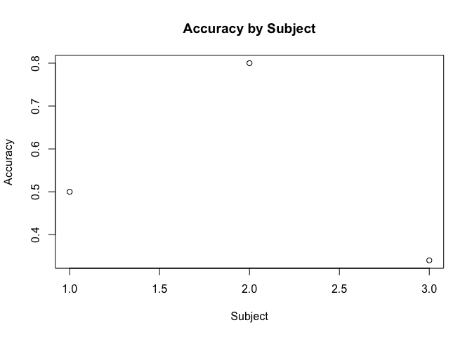

The Accuracy Study
================

# Introduction

We did research on the accuracy of our subject.

# Results

Here is our data:

``` r
accuracy <- read.csv('../01_data/01_raw/accuracy.csv')
plot(accuracy$subj, accuracy$accuracy,
     xlab = "Subject", ylab = "Accuracy", main = "Accuracy by Subject")
```

<!-- -->

``` r
mean_accuracy <- read.csv("../01_data/02_derivatives/analyzed_data.csv")$mean_accuracy
```

The mean accuracy was 0.5466667.

# The End
